<p align="center">
  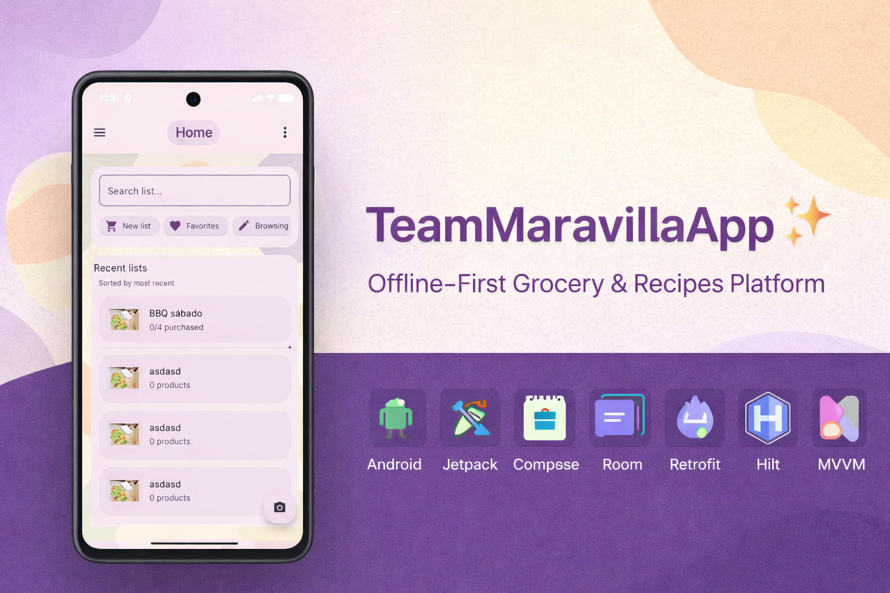
</p>

<h1 align="center">TeamMaravillaApp 🧺✨</h1>
<p align="center">
  Offline-First Grocery Lists & Recipes Platform
</p>

<p align="center">
  <b>Android · Jetpack Compose · Room · Retrofit · Hilt · MVVM</b>
</p>


---

## 📱 Overview

TeamMaravillaApp is a modern Android application designed to manage shopping lists, recipes and favorites, built with a strong focus on:

- Offline-first architecture  
- Clean separation of layers  
- Reactive UI (StateFlow + Jetpack Compose)  
- Resilient synchronization  
- Production-ready modular structure  

This project demonstrates **advanced Android development practices** aligned with real-world mobile architecture patterns.

---

## 🎯 Purpose of the Project

This application was built to demonstrate:

- Clean Architecture principles applied pragmatically  
- Local-first data modeling with **Room as Single Source of Truth**  
- Structured repository orchestration between local and remote layers  
- Real authentication flow with session persistence  
- Scalable project organization suitable for mid-size production apps  

---

## 📸 Application Screens

---

### 🏠 Home
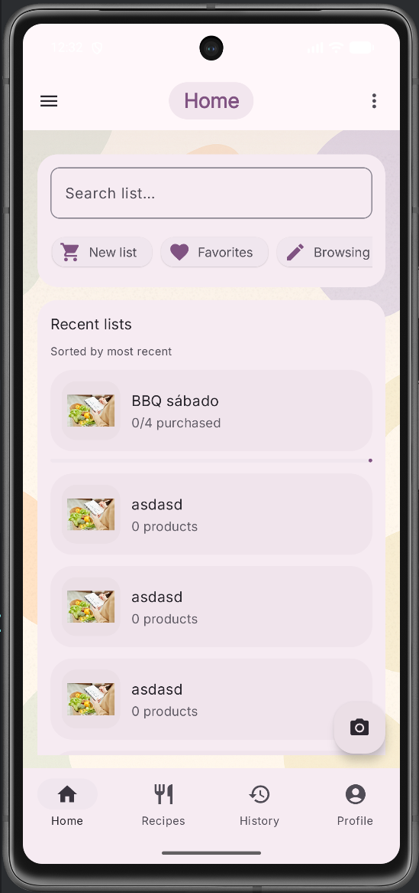

---

### 📝 List Detail
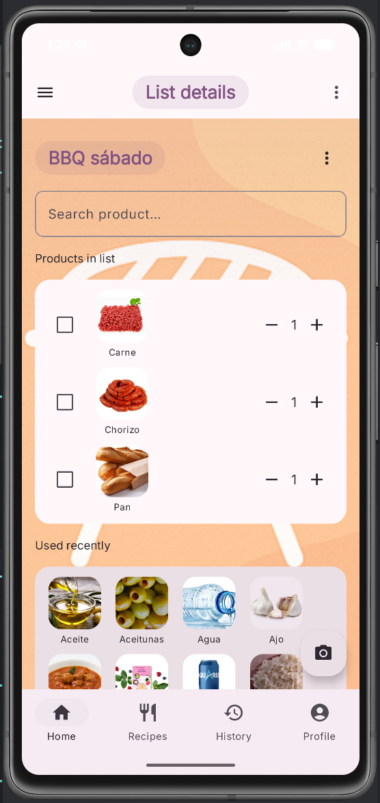

---

### ➕ Create List
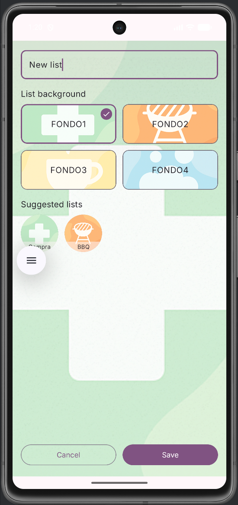

---

### 🔍 Category Filter
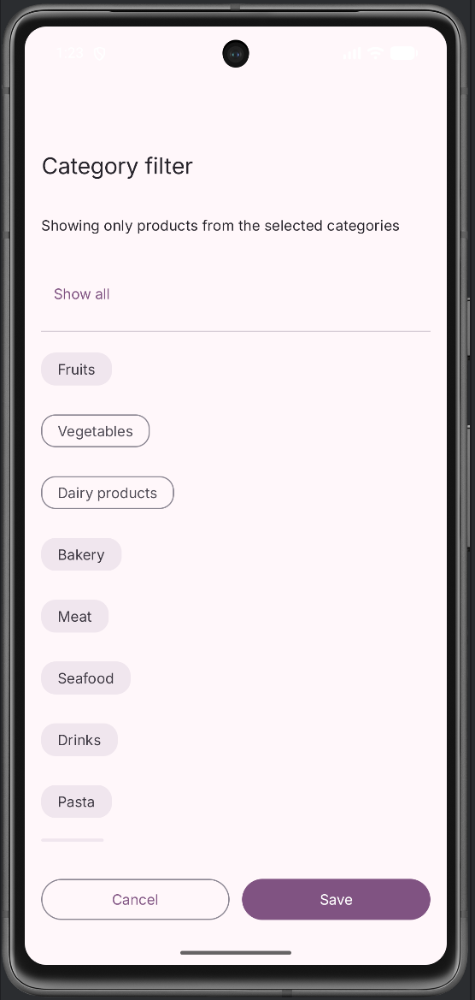

---

### 🗂 List View Types
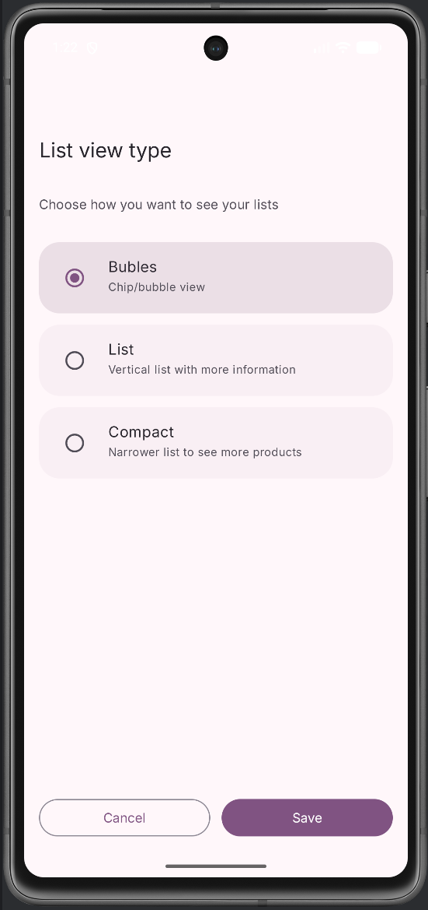

---

### 🛒 Select List
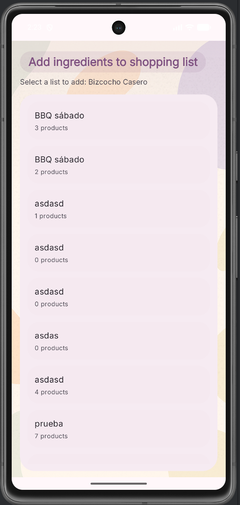

---

### 🍳 Recipes
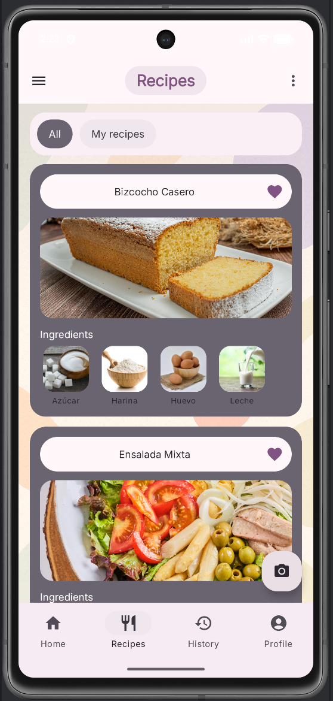

---

### 📖 Recipe Detail
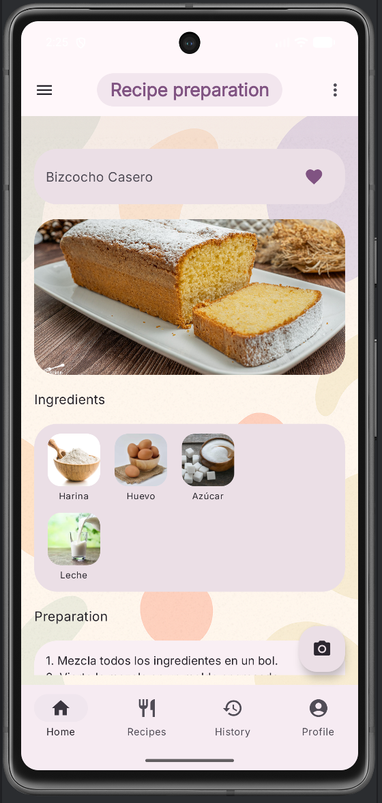

---

### ⭐ Favorites (within Recipes)
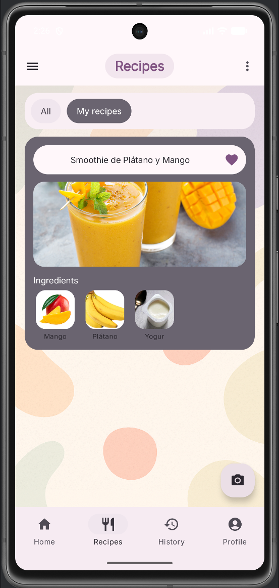

---

### 📊 Stats
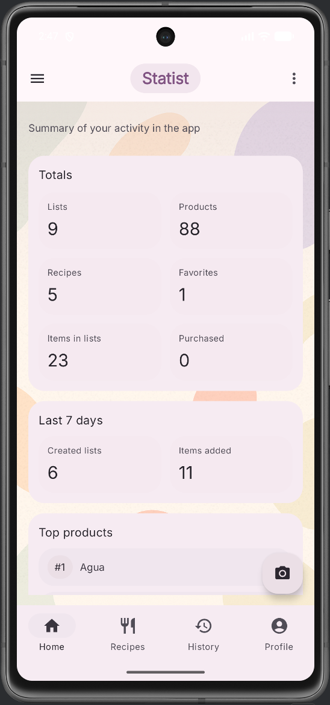

---

### 🕘 History
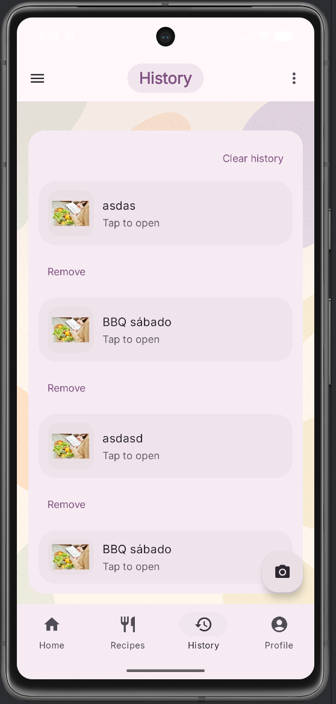

---

### 👤 Profile
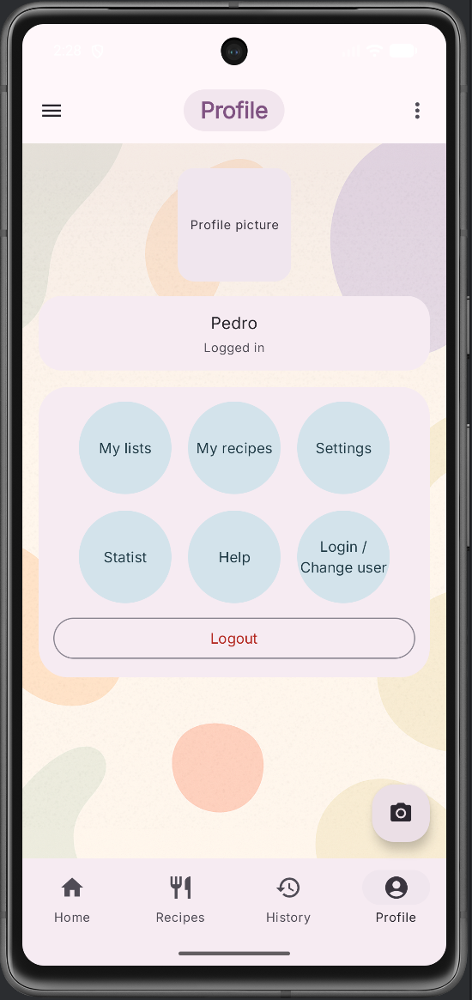

---

### ⚙ Settings
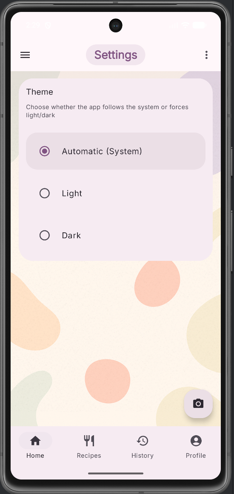

---

### 🔐 Login
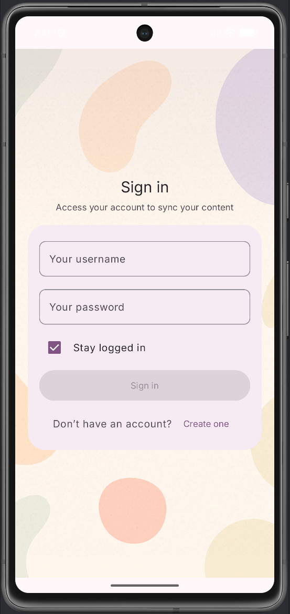

---

### 📝 Register
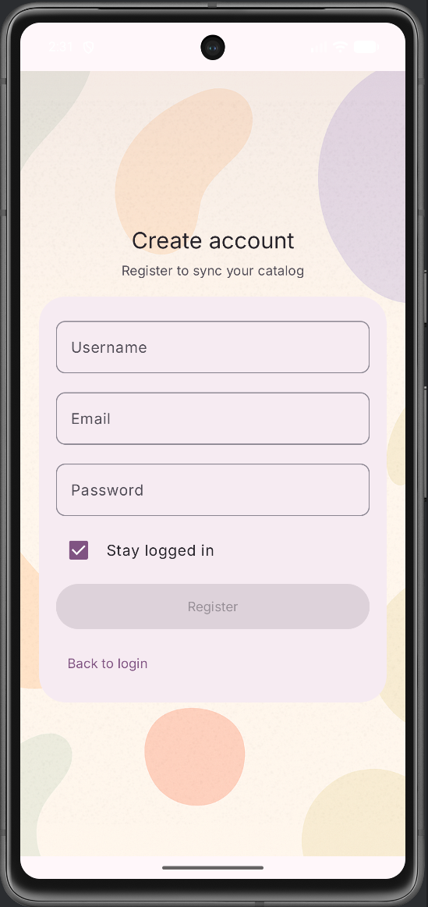

---

### 📷 Camera / Receipt
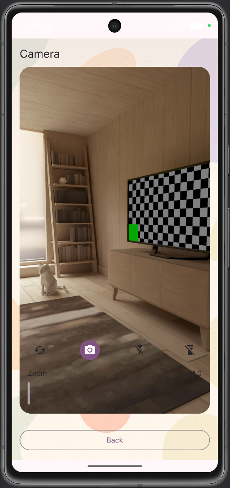

---

### 💡 Help
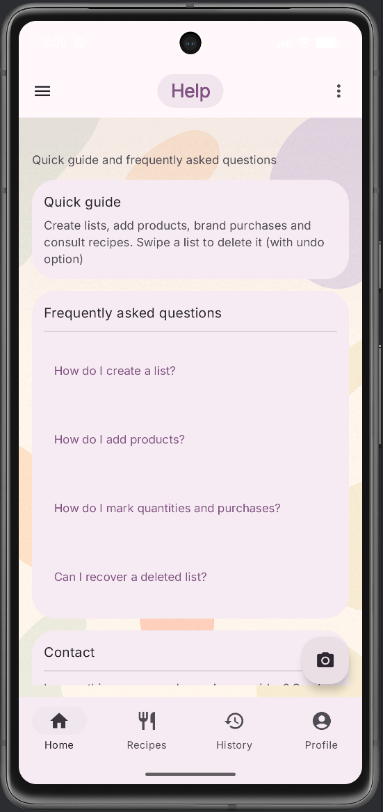

---

### 🚀 Splash
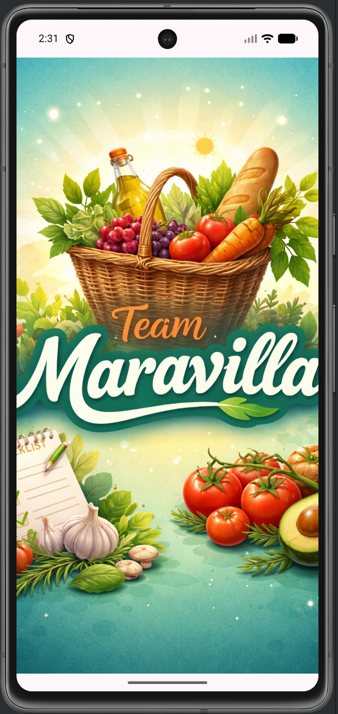


---

## 🏗 Architecture

TeamMaravillaApp follows a **Local-First Clean Architecture** approach.

### High-Level Flow

Compose UI
↓
ViewModel (StateFlow)
↓
Repository (Local-first orchestration)
↓ ↘
Room (Single Source of Truth) Retrofit (Remote sync)


### Core Principles

- UI observes **only Room**, never the network directly  
- Remote refresh runs in background  
- Synchronization is throttled and guarded by `Mutex`  
- DTO ↔ Domain ↔ Entity mapping is fully isolated  
- DataStore handles session and user preferences  

---

## 🧠 Architecture Layers

### UI Layer
- Jetpack Compose  
- Material 3  
- Navigation Compose  
- Lifecycle-aware StateFlow collection  

### Domain Layer
- Pure Kotlin models  
- No Android dependencies  
- Feature-based organization  

### Data Layer

#### Local
- Room database  
- DAO pattern  
- Explicit migrations  
- Flow-based reactive queries  

#### Remote
- Retrofit  
- DTO mapping  
- Best-effort synchronization  
- Mutex-based write protection  

### Session
- DataStore Preferences  
- Reactive session state  
- Token and rememberMe handling  

---

## 🗂 Project Structure

> Package-oriented, scalable and production-ready.

```
com.example.teammaravillaapp
│
├── component/              # Reusable Compose UI components
│   └── legacy/             # Deprecated or transitional components
│
├── data/
│   ├── local/              # Room database layer
│   │   ├── dao/            # Database access objects
│   │   ├── db/             # Database config & migrations
│   │   ├── entity/         # Room entities & relations
│   │   ├── mapper/         # Entity ↔ Domain mappers
│   │   ├── prefs/          # DataStore preferences
│   │   └── repository/     # Local repositories
│   │
│   ├── remote/             # Networking layer (Retrofit)
│   │   ├── api/            # Retrofit API interfaces
│   │   ├── datasource/     # Remote data sources
│   │   ├── dto/            # Network DTO models
│   │   └── mapper/         # DTO ↔ Domain mappers
│   │
│   ├── repository/         # Default repositories (Local + Remote)
│   ├── seed/               # Initial catalog & demo seed data
│   ├── session/            # Session persistence (DataStore)
│   └── sync/               # Synchronization logic & mappers
│
├── di/                     # Hilt dependency injection modules
├── docs/                   # Documentation & assets
├── model/                  # Pure domain models (no Android deps)
├── navigation/             # Navigation graph & route definitions
├── page/                   # Feature-based UI modules
├── ui/                     # App-level UI & theme
└── util/                   # Shared utilities & helpers
```

---

## 🚀 Features

### 🛒 Shopping Lists
- Create / Rename / Delete lists  
- Add products with quantity controls  
- Mark products as purchased  
- Clear purchased items  
- Category filters  
- Multiple view types (List / Compact / Bubbles)  

### 🍳 Recipes
- Recipe detail with ingredients relation  
- Many-to-many product relationship  
- Add ingredients to shopping list  
- Favorites support  

### ⭐ Favorites
- Local persistence (Room)  
- Remote file-based sync  
- Auto-merge on login  

### 📷 Receipts
- CameraX integration  
- Image cropping with uCrop  
- Local persistence  

### 📊 Statistics
- Totals overview  
- Last 7 days activity  
- Top products  
- Reactive database-driven analytics  

### 👤 Authentication
- Login & Register  
- Session persistence  
- rememberMe support  
- Clean logout handling  

---

## 🛠 Tech Stack

| Category | Technology |
|--------|------------|
| UI | Jetpack Compose |
| Architecture | MVVM |
| Dependency Injection | Hilt |
| Database | Room |
| Networking | Retrofit + OkHttp |
| Image Loading | Coil |
| Preferences | DataStore |
| Camera | CameraX |
| Image Crop | uCrop |

---

## 🔄 Sync Strategy

TeamMaravillaApp uses a **local-first synchronization strategy**.

### Key Concepts

- UI is always driven by Room  
- Remote refresh runs inside repositories  
- Refresh is throttled to avoid spamming  
- Mutex prevents concurrent overwrites  
- Network failures never crash the UI  

This guarantees:

- Offline resilience  
- Predictable UI state  
- Reduced network overhead  

---

## 🔐 Build Configuration

The backend base URL is configured via `BuildConfig`.

--- 

📜 License
Proprietary License
Copyright © 2026 Cristian R.
All rights reserved.

This software is provided for portfolio and evaluation purposes only.

No permission is granted to copy, modify, distribute, sublicense, or sell any part of this software without explicit written authorization from the author.

👤 Author
Cristian R.
Android Developer

Jetpack Compose · Clean Architecture · Offline-First Systems
