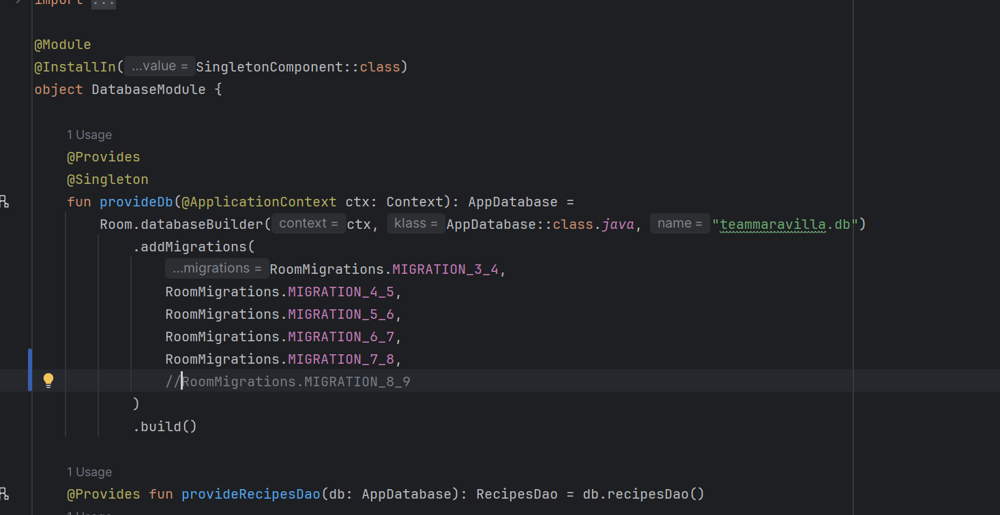

# Apuntes (Compose + Hilt + Room + Retrofit + DataStore + Coil)

---

# ÍNDICE

1. Mapa general
2. Estructura de paquetes que uso siempre
3. Orden exacto en el que construyo un feature
4. Hilt (DI) explicado paso a paso
5. Room explicado desde cero
6. Retrofit explicado desde cero
7. Mappers (por qué existen y cómo los hago)
8. Repository (cache-first real)
9. ViewModel estándar (UiState + UiEvent + UiResult)
10. Compose Screen estándar (lista + detalle)
11. Navigation completo
12. DataStore + sesión
13. Coil (imágenes URL)
14. Feature completo ultra detallado: PRODUCTS
15. Feature completo: RECIPES
16. Auth + Users remotos
17. Checklist final + errores típicos
18. Dependencias
19. Coroutines + Flow (scopes y patrones)
20. 
---

# 1. MAPA GENERAL

4 capas:

UI → ViewModel → Repository → Data (Local + Remote)

- UI solo pinta.
- ViewModel orquesta.
- Repository decide de dónde salen los datos.
- Data contiene Room, Retrofit y Mappers.

Flujo ideal:

UI observa Flow desde Room  
Refresh trae datos de API  
Se guardan en Room  
Room emite cambios  
UI se actualiza sola

---

# 2. ESTRUCTURA DE PAQUETES

```
core/
  di/            -> módulos Hilt (Network/Database/Repositories/DataStore)
  network/       -> utilidades de red (si uso)
  ui/            -> UiResult, UiEvent, etc
  util/          -> constantes, extensiones, helpers

data/
  remote/
    api/         -> interfaces Retrofit
    dto/         -> modelos DTO (JSON)
    datasource/  -> clases que encapsulan llamadas (RemoteDataSource)
    mapper/      -> DTO -> Domain
  local/
    db/          -> AppDatabase
    dao/         -> DAOs
    entity/      -> entidades Room
    datasource/  -> (opcional) LocalDataSource si quiero separar DAO
    mapper/      -> Entity <-> Domain
  repository/    -> implementaciones de repositorios

domain/
  model/         -> modelos puros de la app
  repository/    -> interfaces de repos
  usecase/       -> opcional (si quiero capa extra)

ui/
  navigation/    -> rutas + NavHost
  screens/       -> pantallas por feature
  components/    -> componentes reutilizables
```

---

# 3. ORDEN EXACTO EN EL QUE CONSTRUYO UN FEATURE

Cuando voy a hacer, por ejemplo, Products:

1. Creo el modelo Domain.
2. Creo el DTO.
3. Creo la Entity.
4. Creo el DAO.
5. Añado la Entity a la Database.
6. Creo los mappers.
7. Creo la API Retrofit.
8. Creo el RemoteDataSource.
9. Creo la interfaz Repository.
10. Creo la implementación RepositoryImpl.
11. Hago los módulos Hilt.
12. Creo ViewModel.
13. Creo Screen.
14. Añado navegación.

---

# 4. HILT (INYECCIÓN DE DEPENDENCIAS)

## 4.1 Lo mínimo obligatorio

Application:

```kotlin
@HiltAndroidApp
class TeamMaravillaApp : Application()
```

MainActivity:

```kotlin
@AndroidEntryPoint
class MainActivity : ComponentActivity()
```

ViewModel:

```kotlin
@HiltViewModel
class ProductsViewModel @Inject constructor(
    private val repository: ProductsRepository
) : ViewModel()
```

## 4.2 Piezas mínimas
- `Application` con `@HiltAndroidApp`
- `MainActivity` con `@AndroidEntryPoint`
- ViewModels: `@HiltViewModel` + `@Inject constructor(...)`
- Módulos (`@Module`):
    - `DatabaseModule` (Room)
    - `NetworkModule` (Retrofit/OkHttp)
    - `RepositoryModule` (bind repos)

## 4.3 Patrón de módulos (guía)
- **@Provides** para objetos “construidos” (Retrofit, OkHttp, Room DB, DAOs).
- **@Binds** para interfaces -> implementación (`ProductRepository -> DefaultProductRepository`).

## 4.4 Errores típicos (cuando explota)
- `Cannot create an instance of ...ViewModel`
    - Falta `@AndroidEntryPoint` en Activity
    - ViewModel sin `@HiltViewModel`
    - Dependencia del constructor no está provista en módulos

---

## 4.2 NetworkModule

```kotlin
@Module
@InstallIn(SingletonComponent::class)
object NetworkModule {

    @Provides
    @Singleton
    fun provideOkHttp(): OkHttpClient =
        OkHttpClient.Builder().build()

    @Provides
    @Singleton
    fun provideRetrofit(okHttp: OkHttpClient): Retrofit =
        Retrofit.Builder()
            .baseUrl("https://mi-api.com/")
            .client(okHttp)
            .addConverterFactory(GsonConverterFactory.create())
            .build()
}
```

Método clave:  
`Retrofit.Builder().baseUrl().addConverterFactory().build()`

---

# 5. ROOM DESDE CERO

## 5.0 Nueva tabla Room
- [ ] Entity
- [ ] DAO
- [ ] DB version + Migration
- [ ] Repo methods
- [ ] ViewModel UiState + events
- [ ] UI
- 
## 5.1 Entity

```kotlin
@Entity(tableName = "products")
data class ProductEntity(
    @PrimaryKey val id: String,
    val name: String,
    val imageUrl: String?
)
```

## 5.2 DAO

```kotlin
@Dao
interface ProductDao {

    @Query("SELECT * FROM products ORDER BY name")
    fun observeAll(): Flow<List<ProductEntity>>

    @Query("SELECT * FROM products WHERE id = :id LIMIT 1")
    suspend fun getById(id: String): ProductEntity?

    @Insert(onConflict = OnConflictStrategy.REPLACE)
    suspend fun upsertAll(items: List<ProductEntity>)

    @Query("DELETE FROM products")
    suspend fun clear()
}
```

Método más importante:  
`observeAll()` → devuelve Flow reactivo.

---

## 5.3 Database

Acordarme que cada vez que toque una Entity y haga una migración, tengo que subir la 
versión del esquema.

```kotlin
@Database(
    entities = [ProductEntity::class],
    version = 1
)
abstract class AppDatabase : RoomDatabase() {
    abstract fun productDao(): ProductDao
}
```

---

## 5.4 DI de Room

```kotlin
@Module
@InstallIn(SingletonComponent::class)
object DatabaseModule {

    @Provides
    @Singleton
    fun provideDatabase(
        @ApplicationContext context: Context
    ): AppDatabase =
        Room.databaseBuilder(
            context,
            AppDatabase::class.java,
            "app.db"
        ).fallbackToDestructiveMigration()
         .build()

    @Provides
    fun provideProductDao(db: AppDatabase): ProductDao =
        db.productDao()
}
```
Aquí solo debo usar fallbackToDestructiveMigration() si estoy en fase de desarrollo, porque perdería todos los datos, 
en fase de producción tendría que hacer una clase para migraciones e ir añadiéndolas.

Ejemplo: 


## 5.5 Piezas
- `Entity`: tablas (`RecipeEntity`, `ListEntity`, `ProductEntity`…)
- `DAO`: queries
- `AppDatabase`: `@Database(entities=[...], version = X)`
- `Migrations`: cuando cambia schema

## 5.6 Relación N:M (recetas-ingredientes)
- Tabla cruce `RecipeIngredientCrossRef(recipeId, productId)`
- Queries tipo `@Transaction` con `@Relation` si se usan POJOs de relación.

## 5.7 Reglas prácticas
- Lecturas reactivas: `Flow<List<...>>`
- Escrituras: `suspend` (se hacen desde repo o VM con `viewModelScope.launch`)

## 5.8 Migraciones
- Si se sube versión, añado `Migration(old, new)` al builder.
- Si es demo y no importa perder datos: `fallbackToDestructiveMigration()`

---

# 6. RETROFIT DESDE CERO

## 6.0 Nuevo endpoint Retrofit
- [ ] DTO
- [ ] ApiService
- [ ] Mapper
- [ ] Repo wrapper (errores)
- [ ] ViewModel
- [ ] UI

## 6.1 DTO

```kotlin
data class ProductDto(
    val id: String?,
    val name: String?,
    val imageUrl: String?
)
```

## 6.2 API

```kotlin
interface ProductApi {

    @GET("products")
    suspend fun getProducts(): List<ProductDto>

    @GET("products/{id}")
    suspend fun getProduct(
        @Path("id") id: String
    ): ProductDto
}
```

## 6.3 RemoteDataSource

```kotlin
class ProductRemoteDataSource @Inject constructor(
    private val api: ProductApi
) {
    suspend fun fetchProducts(): List<ProductDto> =
        api.getProducts()
}
```

## 6.4 Piezas
- `ApiService` (endpoints) @GET @PUT, etc.
- DTOs (`ProductDto`)
- Mapper DTO -> domain (`Product`)
- Repo: `getProducts()`, `searchProducts()`, etc.

## 6.5 Regla de oro
Retrofit solo lo toca el **Repository** (o un RemoteDataSource), nunca la UI.

## 6.6 Errores típicos
- “No carga nada”: revisar baseUrl, internet permission (el archivo .xml que creó Pedro, parsing JSON (DTOs).
- Manejar errores: envolver en `Result`/`sealed class`.
- 
---

# 7. MAPPERS

Básicamente:
El DTO representa el formato de la API REST, en este caso del swagger, como recibo información o como la envío allío.
La Entity representa lo que yo uso para guardarlo en ROOM.
Luego está mi modelo, el que yo uso en mi propia app.
- DTO: lo que viene de API
- Entity: lo que guardas en Room
- Domain: lo que usa la app

## DTO → Domain

```kotlin
fun ProductDto.toDomain(): Product =
    Product(
        id = id ?: "",
        name = name ?: "Sin nombre",
        imageUrl = imageUrl
    )
```
Esto convierte un DTO o Entity al modelo de mi app. Por ejemplo la API REST puede permitir nulos y yo en mi app no. Entonces tengo 
que hacer la transformación antes de usar el dato.
## Domain → Entity

```kotlin
fun Product.toEntity(): ProductEntity =
    ProductEntity(
        id = id,
        name = name,
        imageUrl = imageUrl
    )
```
Esto convierte mi modelo al modelo Entity para poder guardarlo en ROOM.
## Entity → Domain

```kotlin
fun ProductEntity.toDomain(): Product =
    Product(id, name, imageUrl)
```

---

# 8. REPOSITORY (CACHE-FIRST)

## Interfaz

```kotlin
interface ProductsRepository {
    fun observeProducts(): Flow<List<Product>>
    suspend fun refreshProducts()
}
```

## Implementación

```kotlin
class ProductsRepositoryImpl @Inject constructor(
    private val dao: ProductDao,
    private val remote: ProductRemoteDataSource
) : ProductsRepository {

    // Aquí mi repositorio de ROOM emite Flow<List<Product>> debido a que esto es entidad, 
    // pero yo le llamé igual nadie sabe porque... tengo que pasarlo a domain.
    // Y así a la UI le llega List<Product> no entity.
    override fun observeProducts(): Flow<List<Product>> =
        dao.observeAll().map { list ->
            list.map { it.toDomain() }
        }

    /*
    Aquí otro ejemplo claro, recibo de remoto ProductDTO, yo hago to domain y lo paso al 
    Product de mi app y después lo cambio a Entity para guardarlo en room.
    Y si porque upsertAll es guardar all.
     */
    override suspend fun refreshProducts() {
        val remoteData = remote.fetchProducts()
        val entities = remoteData
            .map { it.toDomain() }
            .map { it.toEntity() }

        dao.upsertAll(entities)
    }
}
```

---

# 9. VIEWMODEL ESTÁNDAR

Inyecto hilt, creo variable privada inmutable y luego creo la variable no privada de ella.
```kotlin
@HiltViewModel
class ProductsViewModel @Inject constructor(
    private val repository: ProductsRepository
) : ViewModel() {

    private val _state = MutableStateFlow(
        UiResult.Loading as UiResult<List<Product>>
    )
    val state: StateFlow<UiResult<List<Product>>> = _state

    init {
        observeProducts()
        refresh()
    }

    private fun observeProducts() {
        viewModelScope.launch {
            repository.observeProducts().collect {
                _state.value = UiResult.Success(it)
            }
        }
    }

    fun refresh() {
        viewModelScope.launch {
            _state.value = UiResult.Loading
            runCatching { repository.refreshProducts() }
                .onFailure {
                    _state.value = UiResult.Error("Error cargando")
                }
        }
    }
}
```

---

# 10. COMPOSE SCREEN

Hago un collect de la variable no privada de antes. 
Le asigno errores y sigo.
```kotlin
@Composable
fun ProductsScreen(
    viewModel: ProductsViewModel = hiltViewModel()
) {
    val state by viewModel.state.collectAsState()

    when (state) {
        is UiResult.Loading -> Text("Cargando...")
        is UiResult.Error -> Text("Error")
        is UiResult.Success -> {
            val products = (state as UiResult.Success<List<Product>>).data
            LazyColumn {
                items(products) { product ->
                    Text(product.name)
                }
            }
        }
    }
}
```

---

# 11. NAVIGATION

```kotlin
@Composable
fun AppNav() {
    val navController = rememberNavController()

    NavHost(
        navController = navController,
        startDestination = "products"
    ) {
        composable("products") {
            ProductsScreen()
        }

        composable("detail/{id}") { backStack ->
            val id = backStack.arguments?.getString("id")!!
            ProductDetailScreen(id)
        }
    }
}
```

---

# 12. DATASTORE (SESIÓN)

Concepto:
- Guardo token.
- Expongo Flow.
- Redirijo según haya token o no.

## 12.1 Qué guardar aquí
- `isLoggedIn`
- `userId` / `email`
- `token` (si existiese)
- flags UI (onboarding, tema…)

## 12.2 Patrón recomendado (SessionStore)
- `val sessionFlow: Flow<Session>`
- `suspend fun saveSession(...)`
- `suspend fun clearSession()`

## 12.3 Consumo
- Un `AppViewModel` o `SessionViewModel` observa `sessionFlow`
- Decide navegación: login vs home

---

# 13. COIL

Esta librería es para las imágenes. 

```kotlin
AsyncImage(
    model = ImageRequest.Builder(LocalContext.current)
        .data(product.imageUrl)
        .crossfade(true)
        .build(),
    contentDescription = null
)
```

## 13.1 Uso típico
- `AsyncImage(model = url, contentDescription = ...)`
- `contentScale = ContentScale.Crop` para recortar.

---

# 14. CHECKLIST FINAL

- DTO separado de Domain
- Entity separada
- Mappers hechos
- Repo cache-first
- Hilt funcionando
- Navigation limpia
- Flow reactivo
- No usar DTO en UI
- No usar Entity en UI

---

# 15. ERRORES TÍPICOS / PETADAS

Si la UI no actualiza:
→ No estoy observando Flow.

Si crashea ViewModel:
→ Falta @AndroidEntryPoint o módulo @Binds.

Si sale vacío:
→ Mapper mal hecho o DTO null.

Si Room revienta:
→ Version sin migration. IMPORTANTE.

---

# 18. DEPENDENCIAS

- **Hilt**: inyectar repos, DAOs, Retrofit, DataStore, etc.
- **Room**: base de datos local (listas, recetas, productos guardados…).
- **Retrofit**: consumir API (catálogo de productos, etc.).
- **DataStore**: sesión y settings simples (loggedIn, token, user…).
- **Coil**: carga de imágenes (url/drawable) en Compose.

---

# 19. Coroutines + Flow (scopes y patrones)

## 19.1 Dónde lanzar cosas
- ViewModel: `viewModelScope.launch { ... }`
- Repo: `withContext(Dispatchers.IO)` cuando haga falta (si no devuelve Flow).

## 19.2 Patrones útiles
- `combine()` para mezclar flows (p.ej. filtros + lista).
- `stateIn()` para convertir Flow a StateFlow.

## 19.3 Errores típicos
- Coleccionar flow en Compose sin `LaunchedEffect` -> duplicidades por recomposición.
- Meter `.launch` en Composables sin control.